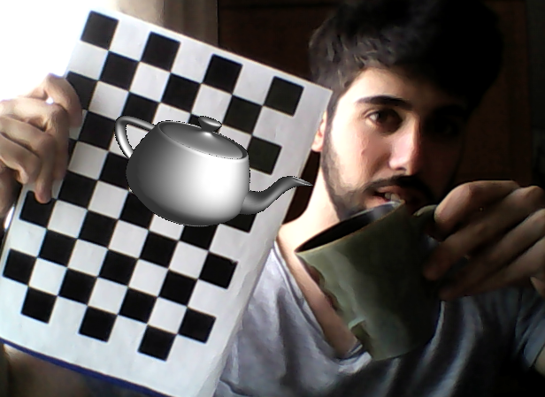
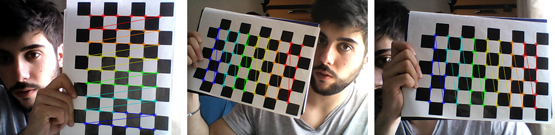

# Webcam 2D Augmented Reality

Webcam 2D AR is a **Python OpenCV** application to bring **any object** into existence using the **webcam** of your laptop.
<p align="center">
  
</p>

## Requirements
* Python 2.7
* NumPy library.
* OpenCV library.

## Instruction Manual
1. Download **[Webcam 2D AR](python)** and run it typing **run.py**
```bash
python run.py
```

2. Calibrate your webcam to **[remove distortion](http://docs.opencv.org/3.1.0/dc/dbb/tutorial_py_calibration.html)**, taking pictures (10 at least) of **[this calibration pattern board](imgs/cpattern.png)** with different angles.
```python
Press key 'c' to capture a frame...
```
<p align="center">
  
</p>

3. Finally, type **the name of the image** you want to project onto the board.
```python
Introduce the name of the image: test.png
```
